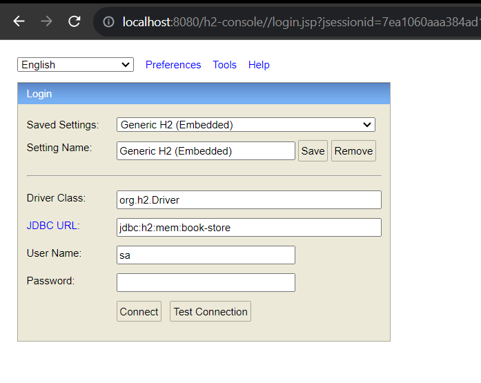
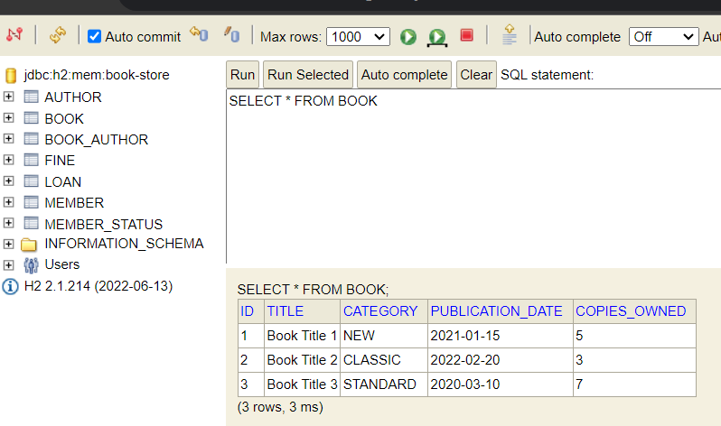
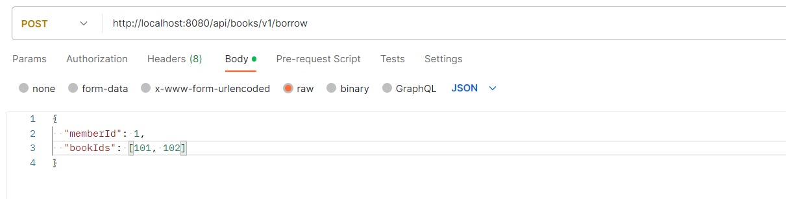

# **Library System Overview:**

The library system is designed to manage books, loans, and members. It provides functionalities for borrowing and returning books, as well as handling fines for overdue books.

Key Components:

### **Controllers:**

**BookController**: Manages operations related to books, including borrowing.

**LoanController**: Handles loan-related operations.

**MemberController**: Manages members and their operations.

### **Data Access Objects (DAOs):**

**BookDao**: Provides access to book-related data in the database.

**FineDao**: Deals with fine-related data and operations.

**LoanDao**: Handles loan-related data and interactions.

**MemberDao**: Manages member-related data.

### DAO Implementations:

**BookDaoImpl, FineDaoImpl, LoanDaoImpl, MemberDaoImpl:** Implementations of the DAO interfaces, handling database interactions.

### DTOs (Data Transfer Objects):

AuthorDto, BookDto: Objects used for transferring data between layers.

### Request and Response Objects:
**AddBookRequest, BorrowRequest, ReturnRequest:** Request objects for adding, borrowing, and returning books.

**BooksByCategoryResponse, BorrowResponse, ErrorResponse, etc.:** Response objects for various API requests.
Entities:

**Author, Book, BookCategory, Loan, Member, MemberStatus:** Entity classes representing real-world concepts.

### Exceptions:

Various custom exceptions for handling different error scenarios, like **BookNotFoundException**, **BorrowingLimitExceededException**, etc.

### Factory:

**BorrowingStrategyFactory**: Provides strategies for different types of book borrowing.

### Scheduler:

**FineProcessingService, ScheduledTasks**: Handles tasks related to fines processing and scheduling.

### Services:

**BookService, BorrowService, FineService, LoanService, MemberService, ReturnService**: Implement various business logic for respective functionalities.

### Service Implementations:

**BookServiceImpl, BorrowServiceImpl, etc.:** Implementations of the service interfaces.

### Strategy Pattern:

**BorrowingStrategy, CommonBorrowValidationStrategy, etc.:** Implement borrowing validation strategies.
Validation:

**MaxTotalBorrowedStrategy**: Validates borrowing based on the total number of books borrowed.

## Borrowing Books Flow:

1. A request to borrow books is received in BookController via the POST endpoint /api/books/v1/borrow.
2. The controller delegates the request to BorrowService.
3. BorrowService fetches the member details and book details using MemberDao and BookDao.
4. It applies a specific borrowing strategy based on the book category (classic, new, standard) using the BorrowingStrategyFactory.
5. The strategy (BorrowingStrategy) validates the borrowing based on specific rules (e.g., maximum total borrowed, maximum NEW-books).
6. If the validation is successful, a loan entry is saved in the database via LoanDao and the number of copies is updated in BookDao.
7. A Loan object is created and returned to the BookController, which then constructs a BorrowResponse and sends it back as the API response.

## Returning Books Flow:
1. A request to return books is received in BookController via the POST endpoint /api/books/v1/return.
2. The controller delegates the request to ReturnService.
3. ReturnService validates the return request and retrieves the list of returned book IDs.
4. It updates the loan status and copies owned in LoanDao and BookDao respectively.
5. A ReturnResponse is constructed and returned as the API response.

### APIS

* Borrow Books 
* Return Books 
* Add New Book
* Get Books By Book Category
* Get Loans By Member Id
* Get Members With Fines

## Database

This database is designed to manage a library's collection of books, authors, members, loans, and fines. It allows for tracking book information, member details, loan transactions, and fines incurred.

H2 database is used for the ease of use and minimize configurations. 

schema.sql contains DDL
data.sql contains DLL

url - http://localhost:8080/h2-console

### Entities After Normalized:

Book: Represents information about individual books in the library's collection.

Author: Stores details about authors who have written books in the collection.

Book_Author: A linking table establishing a many-to-many relationship between books and authors.

Member_Status: Holds various status values for library members (e.g., active, inactive).

Member: Records information about library members, including their membership status.

Loan: Tracks loan transactions, including the book borrowed, member involved, and relevant dates.

Fine: Stores information about fines incurred by members for overdue books.

## Run Instructions

* Java 17 installed
* run command : java -jar library-0.0.1-SNAPSHOT.jar

Need to change the fine days and change the port use this command
* java -jar library-0.0.1-SNAPSHOT.jar --server.port=8081 --library.fine.days=31

### Unit Test

Used Junit and Mokito to create tests

## Postman Tests 

I used postman tool to test the apis other than the Unit tests. Here are the instructions to test
Assume server port is 8080
example image

Request 1: Borrow Books
HTTP Method: POST
Request URL: http://localhost:8080/api/books/v1/borrow
Request Body:
Type: JSON (application/json)
Body:

`
{
"memberId": 1,
"bookIds": [101, 102, 103]
}
`

Request 2: Return Books
HTTP Method: POST
Request URL: http://localhost:8080/api/books/v1/return
Request Body:
Type: JSON (application/json)
Body:

`{
"memberId": 1,
"bookIds": [102],
"loanIds": [103]
}`

Request 3: Add Book.
HTTP Method: POST.
Request URL: http://localhost:8080/api/books/v1/add
Request Body:
Type: JSON (application/json)
Body: 

`{
"book": {
"title": "Sample Book",
"category": "NEW",
"publicationDate": "2023-10-18",
"copiesOwned": 5
},
"authors": [
{
"firstName": "John",
"lastName": "Doe"
},
{
"firstName": "Jane",
"lastName": "Doe"
}
]
}`

Request 4: Get Books by Category
HTTP Method: GET
Request URL: http://localhost:8080/api/books/v1/NEW

Request 4: Get Loans By Member
HTTP Method: GET
Request URL: http://localhost:8080/api/loans/v1/member/6

## Assumptions 

* Fine days(default 30 days) common for all books.
* There might be another Book categories with the different validation strategies in the future.
* One book can have more than one author.
* Only the books available to borrow.